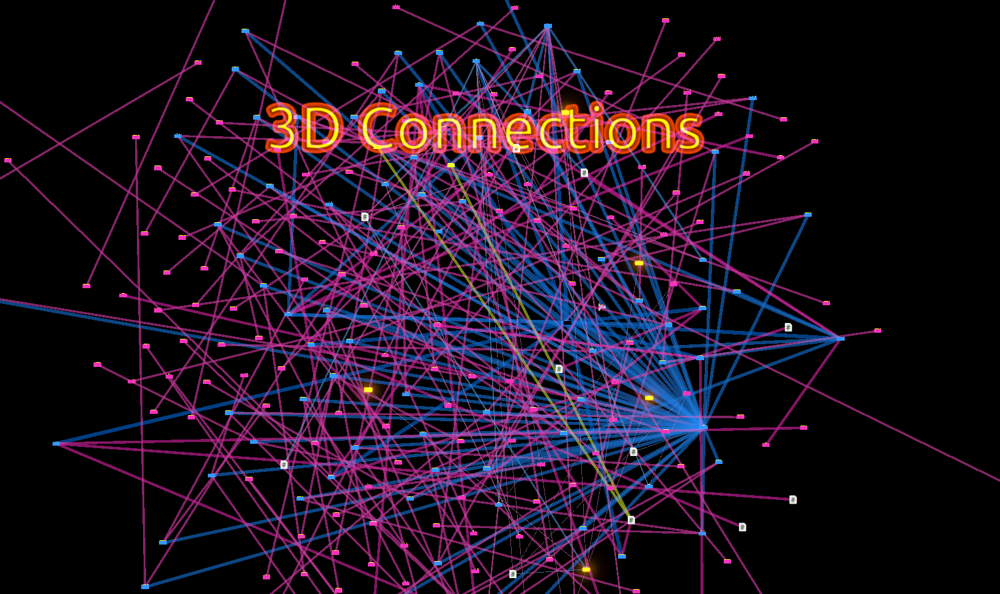

# 
This is a Unity Extension used to primarily visualize and analyze scenes in Unity.

# Installation
- in the unity package manager, add this package via git: https://github.com/FlorianMehnert/3DConnections.git
- when extension is installed go to `Tools/3DConnections/` and execute the following:
  - Copy and Add Overlay Scene
  - Add OverlayScene Layer
- In a scene you want to analyze open the context menu (right click) in the Hierarchy: `3DConnections/Add Entrypoint`
- You might also want to change the render pipeline in `Edit/Project Settings` under Graphics to the Universal Render Pipeline Asset (not 2D) for bloom

## GUIBuilder
- execute all Button GUI Methods to ensure proper placement of UI Elements

## ClassParser & ClassReferences
- see SceneConnections

## SceneHandler
- mainly to add another Scene which is loaded in Addivite mode (overlaying the existing scenes)

## NodeBuilder
- Handle the creation and composition of the nodes later used to display dependencies

# How to register new settings
This is an easier way to test settings I just throw together. Also this is only supposed to be used in manager scripts and similar components.
- say you have this field `private bool _showFPS;` you can register the setting using
```csharp
[RegisterModularSetting("Show FPS", "Show the current fps (F3)", "Debug", false)]
private bool _showFPS;
```
- then also inherit from `ModularSettingsUser` instead of `MonoBehaviour`
- somewhere later e.g. `Awake()` you need to call the following:
```csharp
RegisterModularSettings();
```
