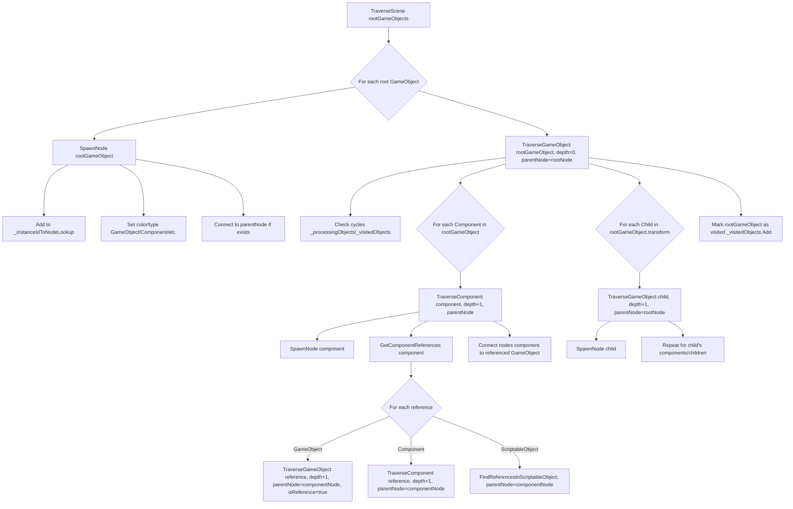

# SceneAnalyzer
- here is a basic depiction of the algorithm used to traverse the scene

```mermaid
flowchart TD
    C[TraverseScene rootGameObjects]

    C --> D{For each root GameObject}
    D --> E[SpawnNode rootGameObject]
    E --> E1[Add to _instanceIdToNodeLookup]
    E --> E2[Set color/type GameObject/Component/etc.]
    E --> E3[Connect to parentNode if exists]

    D --> F[TraverseGameObject rootGameObject, depth=0, parentNode=rootNode]
    F --> G[Check cycles _processingObjects/_visitedObjects]

    F --> H{For each Component in rootGameObject}
    H --> I[TraverseComponent component, depth+1, parentNode]
    I --> I1[SpawnNode component]
    I --> I2[GetComponentReferences component]
    I2 --> I3{For each reference}
    I3 -->|GameObject| I5[TraverseGameObject reference, depth+1, parentNode=componentNode, isReference=true]
    I3 -->|Component| I7[TraverseComponent reference, depth+1, parentNode=componentNode]
    I3 -->|ScriptableObject| I9[FindReferencesInScriptableObject, parentNode=componentNode]
    I --> I10[Connect nodes component to referenced GameObject]

    F --> J{For each Child in rootGameObject.transform}
    J --> K[TraverseGameObject child, depth+1, parentNode=rootNode]
    K --> K1[SpawnNode child]
    K --> K2[Repeat for child's components/children]
    F --> L[Mark rootGameObject as visited _visitedObjects.Add]

```